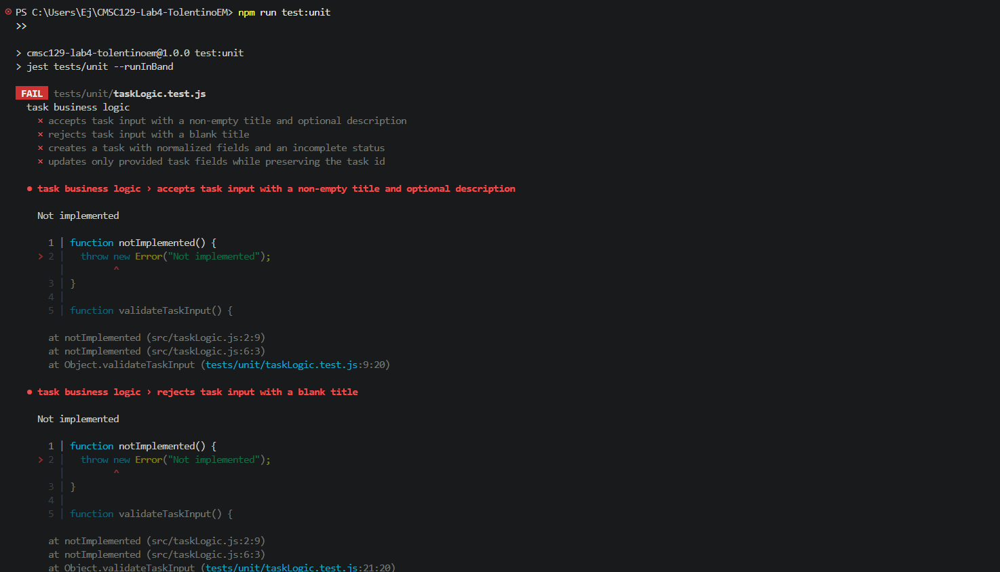
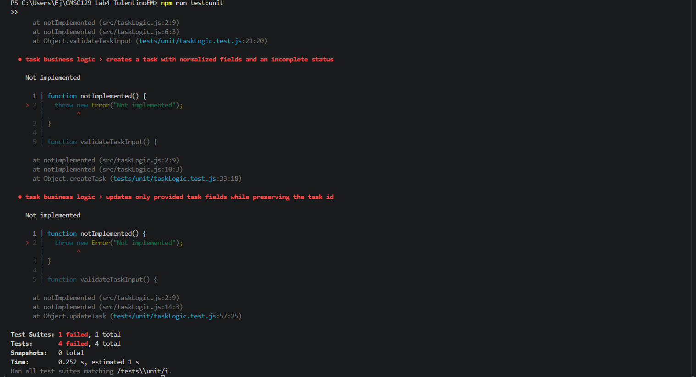
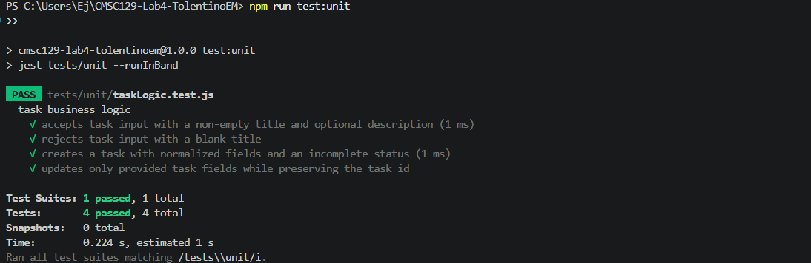
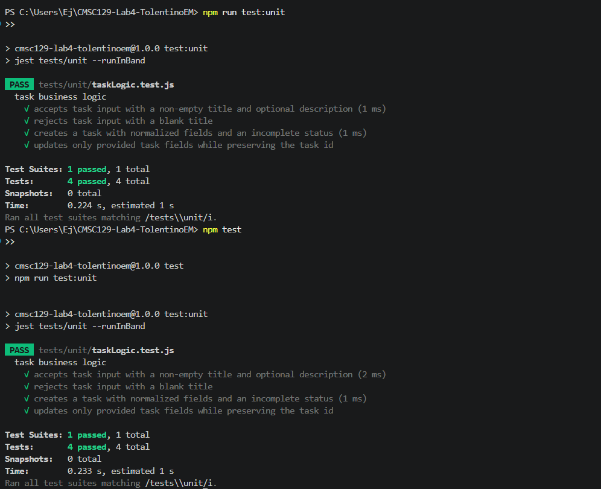
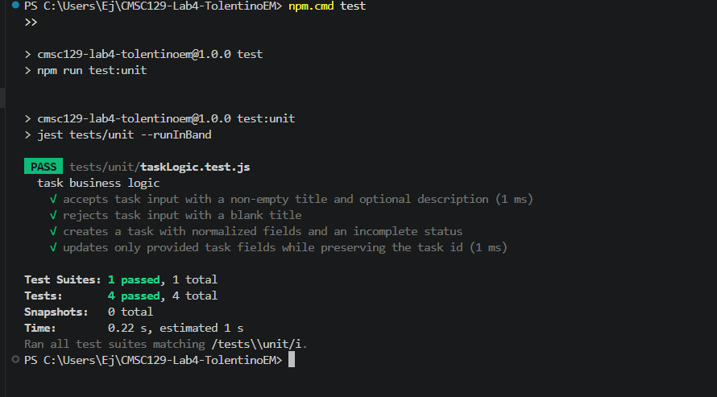
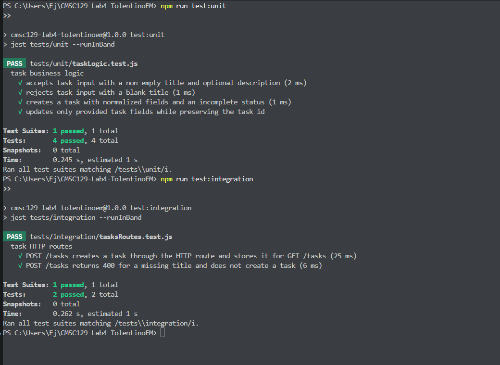
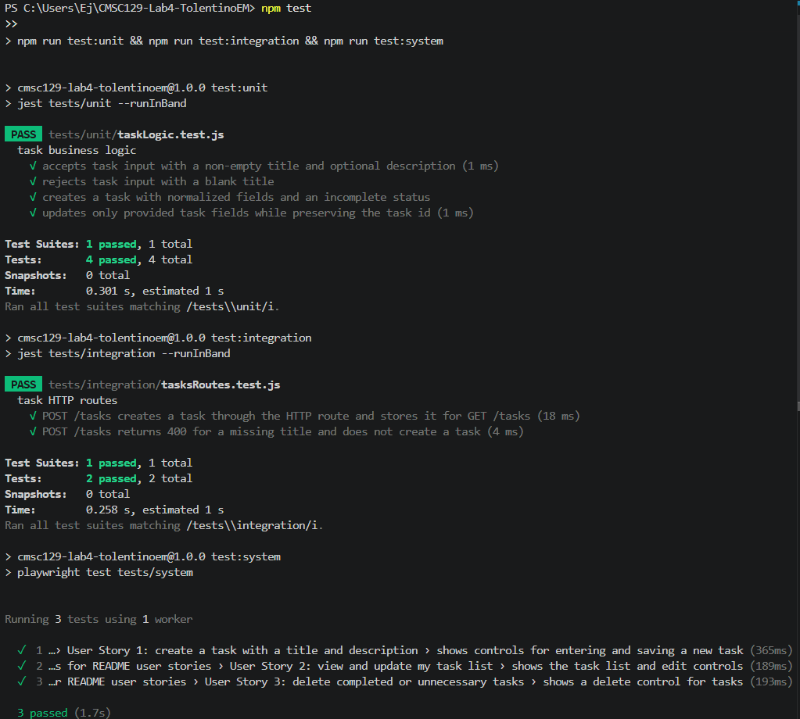

# CMSC129 Lab 4 - Task Manager CRUD App

## App Description

This project is a simple Task Manager CRUD web application built for CMSC 129 Laboratory Assignment 4. Users can create tasks, view the current task list, update task details or completion status, and delete tasks that are no longer needed. The application focuses on one resource only, `Task`, and will be developed using Test-Driven Development through the Red-Green-Refactor cycle.

Live deployment: https://jayyyyupv.github.io/CMSC129-Lab4-TolentinoEM/

## User Stories

1. As a student, I want to create a task with a title and description, so that I can record work I need to finish.
2. As a student, I want to view and update my task list, so that I can track changes in my responsibilities.
3. As a student, I want to delete completed or unnecessary tasks, so that my task list stays organized.

## Tech Stack

- Frontend: HTML, CSS, and vanilla JavaScript
- Backend: Node.js built-in `http` module
- Data Storage: Browser `localStorage` for the deployed frontend and an in-memory array for the local Node.js routes
- Unit Testing: Jest
- Integration Testing: Jest with real HTTP requests
- System Testing: Playwright
- CI/CD: GitHub Actions

## Testing Strategy

### Unit Tests

Unit tests will focus on the isolated task business logic in `src/taskLogic.js` without HTTP requests, browser interaction, or a database. The current Jest tests in `tests/unit/taskLogic.test.js` check that:

- `validateTaskInput()` accepts a task with a non-empty title and optional description.
- `validateTaskInput()` rejects a blank title with the error `Title is required`.
- `createTask()` trims task text fields, assigns the provided `id`, and sets `completed` to `false`.
- `updateTask()` preserves the original task `id` while updating only the provided fields.

These tests currently pass.

### Integration Tests

Integration tests in `tests/integration/tasksRoutes.test.js` start the real HTTP server, send real requests to the task routes, and verify that the route layer works together with the task business logic and in-memory data store.

### System Tests

System tests in `tests/system/taskUserStories.spec.js` use Playwright to open the task page in a real browser. Each describe block maps to one README user story.

## Setup Instructions

### Clone the Repository

```bash
git clone <repository-url>
cd CMSC129-Lab4-TolentinoEM
```

### Install Dependencies

```bash
npm install
```

On Windows PowerShell, use `npm.cmd` if `npm` is blocked by the execution policy:

```bash
npm.cmd install
```

### Run the Application

```bash
npm start
```

On Windows PowerShell:

```bash
npm.cmd start
```

### Run Tests

```bash
npm test
```

On Windows PowerShell:

```bash
npm.cmd test
```

### Run Unit Tests

```bash
npm run test:unit
```

On Windows PowerShell:

```bash
npm.cmd run test:unit
```

### Run Integration Tests

```bash
npm run test:integration
```

On Windows PowerShell:

```bash
npm.cmd run test:integration
```

### Run System Tests

```bash
npm run test:system
```

On Windows PowerShell:

```bash
npm.cmd run test:system
```

## Test Results


### Unit Test Results

#### Commit 1 - `[RED] Unit tests`

Command used:

```bash
npm run test:unit
```

Expected result: failed unit tests because `src/taskLogic.js` only contained Red phase stubs that threw `Not implemented`.

Summary:

- Test Suites: 1 failed, 1 total
- Tests: 4 failed, 4 total
- Failure reason: `Not implemented`





#### Commit 2 - `[GREEN] Implement task validation logic`

Command used:

```bash
npm run test:unit
npm test
```

Expected result: all unit tests passed after implementing only the minimum task logic required by the Red tests.

Summary:

- Test Suites: 1 passed, 1 total
- Tests: 4 passed, 4 total





#### Commit 3 - `[REFACTOR] Refactor task normalization logic`

Command used:

```bash
npm.cmd test
```

Expected result: all unit tests still passed after extracting task title and field normalization helpers.

Summary:

- Test Suites: 1 passed, 1 total
- Tests: 4 passed, 4 total




### Integration Test Results

Failed integration test output:
```bash
npm run test:integration
```

Summary:
- Test Suites: 1 failed, 1 total
- Tests: 2 failed, 2 total


Passing integration test output:
Command:
```bash
npm run test:integration
```

Summary:
- Test Suites: 1 passed, 1 total
- Tests: 2 passed, 2 total



### System Test Results


### Full Test Suite Results

Command:
```bash
npm.cmd test
```

Summary:
- Unit Tests: 4 passed
- Integration Tests: 2 passed
- System Tests: 3 passed




## CI/CD Setup

GitHub Actions runs `npm test` on every push and pull request to `main`. The full test command runs all three levels:

```bash
npm run test:unit
npm run test:integration
npm run test:system
```

The workflow also deploys the static frontend in `public/` to GitHub Pages after the test job passes. The live deployed version uses browser `localStorage`, which makes it compatible with GitHub Pages. The Node.js `/tasks` routes are still kept for the local app and integration testing.

Deployment target:

```text
https://jayyyyupv.github.io/CMSC129-Lab4-TolentinoEM/
```

### Commit History Note

Two documentation-only commits were pushed with non-standard messages (`Readme Changes` and `Readme and andd screenshots`) instead of the required `[DOCS]` prefix. The commits were not rewritten or force-pushed because the assignment uses Git history as evidence of the TDD timeline. The main Red-Green-Refactor commits remain visible in chronological order, and later documentation updates use the required commit prefix.

## Reflection

Doing the testing before the implementation was definitely challenging mentally. It took a reset from how projects are usually made because I had to focus on fulfilling the basic tasks and tests first instead of immediately starting with the code. It forced me to take everything step by step and really analyze what needed to be done, what the plan for the code should be, and how each part of the application should behave before building it. The most difficult part was not just writing tests, but writing tests that were actually correct, useful, and relevant to the project design. In all honesty, I was not able to make the tests correctly at first, so I had to change a lot during the system refactor. That showed me that one of the biggest challenges in TDD is creating tests that are all-encompassing enough to guide the project without being unclear or disconnected from the real user stories.

Writing tests first also changed the way I designed the code. It pushed me to focus on the bare minimum and the essentials before anything else. When coding normally, it is easy to get sidetracked by user interface changes or extra features that may be nice but are not necessary for the core function of the project. By having tests that the code needed to satisfy, I had to pause and focus on what needed to be built first. This made the design more organized because the task logic, HTTP routes, and system behavior had clearer responsibilities. The tests helped define the structure of the code instead of the code being written randomly and tested only afterward.
